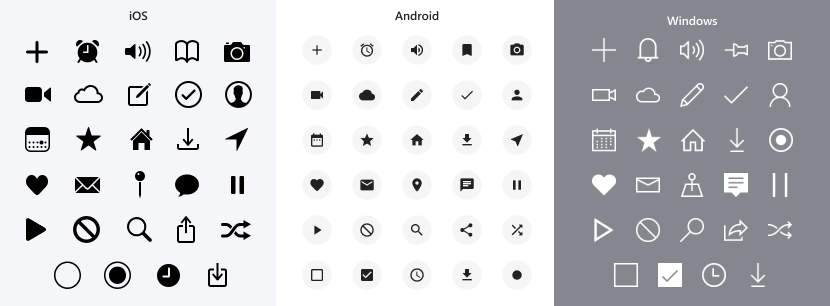

# AppActions.Icons.Maui

A .NET MAUI library that provides some default icons for AppActions without having to create your own.

|Latest Version||
|---|---|
| Build | [](https://github.com/adenearnshaw/AppActions.Icons.Maui/actions/workflows/ci.yml) |
| NuGet | [](https://www.nuget.org/packages/AppActions.Icons.Maui/) |

## Features

Based on iOS' [Home Screen Quick Action Icons](https://developer.apple.com/design/human-interface-guidelines/ios/icons-and-images/system-icons#home-screen-quick-action-icons), this library provides similar icons for both Android & Windows, but styled towards the platforms default design style. Also supports the use of [SFSymbols](https://developer.apple.com/sf-symbols/) as Icons on iOS.



- Out-of-the-box icons available for Android, iOS & Windows
- Use SF Symbols on iOS
- Customise Android icons with brand colors
- Builds on top of the [Maui Essentials](https://docs.microsoft.com/en-us/dotnet/maui/platform-integration/appmodel/app-actions?tabs=android) api
- Specify different image names per platform

## Getting Started

1. Add the [AppActions.Icons.Maui](https://www.nuget.org/packages/AppActions.Icons.Maui/) nuget package to your MAUI project.
1. Setup you app actions as per the [Maui Documentation](https://docs.microsoft.com/en-us/dotnet/maui/platform-integration/appmodel/app-actions?tabs=android)
1. In your `MauiProgram.CreateMauiApp()`, add **`UseAppActionIcons()`** to your Essentials configuration builder.

    ```csharp
    public static MauiApp CreateMauiApp()
    {
        var builder = MauiApp.CreateBuilder();
        builder
            .UseMauiApp<App>()
            .ConfigureEssentials(essentials =>
            {
                essentials
                    .UseAppActionIcons() // Add this line
                    .AddAppAction("home_sc", "Home", icon: AppActionIcon.Home)
                    .OnAppAction(App.HandleAppActions);
            });

        return builder.Build();
    }
    ```

1. Now set the AppAction's icon property using one of the provided `AppActionIcon` options.

### Using SF Symbols

Declare an SF Symbol for iOS and use your own custom icon on other platforms

1. Replace the icon property value with `SystemSymbol()` passing in the SF Symbol name.

    ```csharp
    .AddAppAction("record_sc", "Record", icon: new SystemSymbol("mic.circle.fill"))
    ```

    > On non-iOS platforms the periods (.) in the name are replaced with underscores (_). So `mic.circle.fill` will need a custom Android/Windows image called `mic_circle_fill`.
2. Add your icon for other platforms into the **Resources\Images** folder.

### Using SF Symbols with AppActionIcon fallback

Declare an SF Symbol for iOS and use one of the other provided icons for other platforms

1. Use the `PlatformString()` to set specific icons for each platform within `SystemSymbol`

    ```csharp
    .AddAppAction("pause_sc", "Pause", icon: new SystemSymbol(new PlatformString(AppActionIcon.Prohibit, ios: "pause.circle.fill")))
    ```

    > This will use the default Pause icon on Window & Android. On iOS, this will use the SF Symbol of a filled circle with an pause icon in it.

### Using a different icon per platform

The `PlatformString` can be used independently of `SystemSymbol` to be able to declare custom icons for each platform

1. Use the `PlatformString()` to set specific icons for each platform

    ```csharp
    .AddAppAction("stop_sc", "Stop", icon: new PlatformString("quicklaunch_stop", android: "ic_app_action_stop", ios: "quickaction_stop"))
    ```

### Customise the icon colors on Android

Each Android icon uses a VectorDrawable and as such, the colors of the icon and the circle's background are variables that can be overriden.

1. In your app's **Platforms\Android\Resources\values\colors.xml** file, add additional properties for `appActionBackground` and `appActionForeground`.

    ```xml
    <?xml version="1.0" encoding="utf-8"?>
    <resources>
        ...

        <color name="appActionBackground">#E6DFFC</color>
        <color name="appActionForeground">#512BD4</color>
    </resources>
    ```

    When set the icons will change from the default gray color to those of your choosing.

    

## Creating a custom icon

Each platform has different specifications for the icons needed for shortcuts.

### Android

|Android Icon Dimensions||
|---|---|
| Width | 48px |
| Height | 48px |

*Along with PNGs and JPGs, Android also supports VectorDrawables. A sample icon can be found [here](resources/SampleIcon.xml)*

- [Android App Shortcuts design guidelines](https://commondatastorage.googleapis.com/androiddevelopers/shareables/design/app-shortcuts-design-guidelines.pdf)  
- [Material icons](https://material.io/icons/)  

### iOS

|iOS Icon Dimensions||
|---|---|
| Width | 35px |
| Height | 35px |

Images should be added to the AssetCatalog with the `Render As:` option set to `Template Image`


- [Human Interface Guidelines - Quick Actions](https://developer.apple.com/ios/human-interface-guidelines/icons-and-images/system-icons#home-screen-quick-action-icons)

### Windows

|Windows Icon Dimensions||
|---|---|
| Width | 44px |
| Height | 44px |

- [UWP icon specifications](https://docs.microsoft.com/en-us/windows/uwp/design/shell/tiles-and-notifications/app-assets)  
- [UWP icons](https://docs.microsoft.com/en-us/windows/uwp/design/style/segoe-ui-symbol-font)

## Troubleshooting

### Opening links in the same Android instance each time

If the app is backgrounded and a shortcut is tapped, your app may relaunch and re-initialized the App from scratch, wiping any existing navigation backstack. This is caused by the MainActivity recreating itself when coming in via the IntentFilter. To re-launch the app in the same instance that was backgrounded add the following property to the `Activity` attribute in your **MainActivity**

```csharp
LaunchMode = LaunchMode.SingleTask
```

## Resources

- MAUI AppActions Docs: [docs.microsoft.com](https://docs.microsoft.com/en-us/dotnet/maui/platform-integration/appmodel/app-actions?tabs=android)
- Apple Human Interface Guidelines [HID Home screen quick actions](https://developer.apple.com/design/human-interface-guidelines/ios/icons-and-images/system-icons#home-screen-quick-action-icons)
- iOS implementation based on: [dotnet/maui/essentials/appactions](https://github.com/dotnet/maui/blob/main/src/Essentials/src/AppActions/AppActions.ios.cs)
